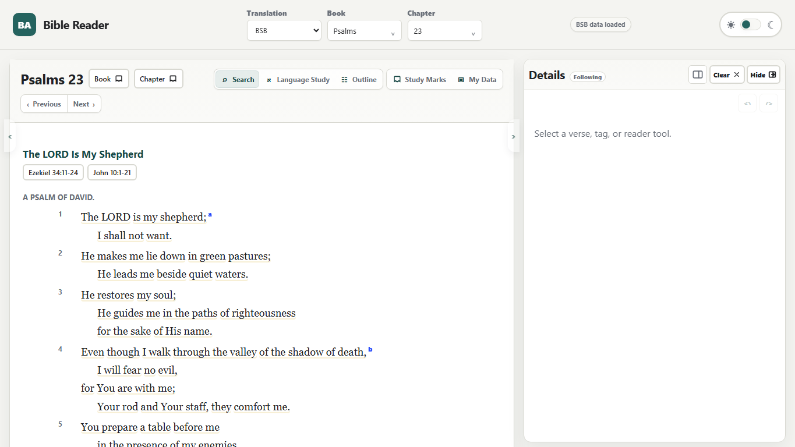
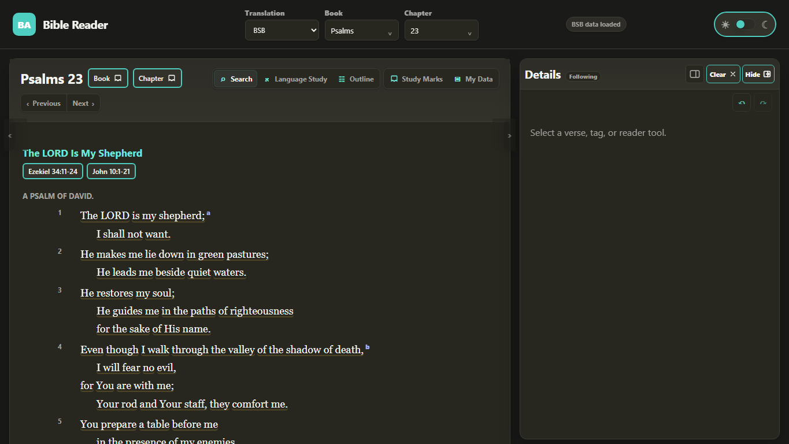
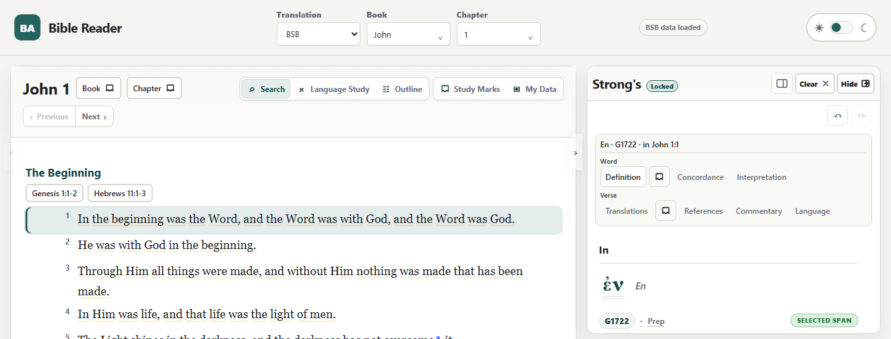
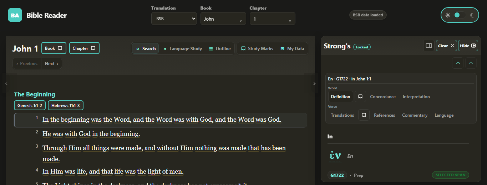
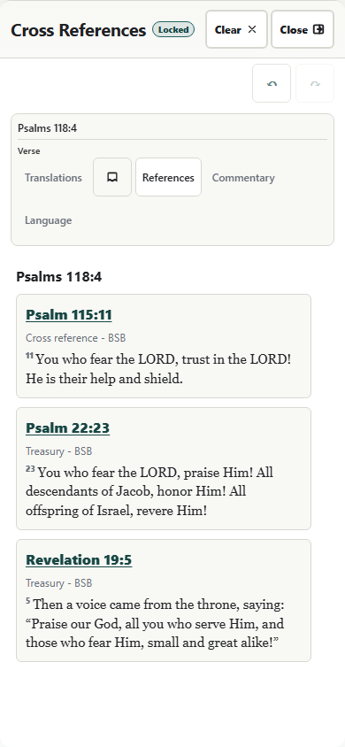
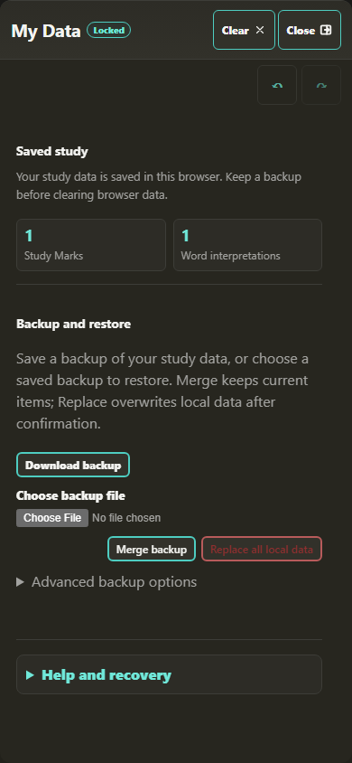

# Bible App Reader

> **PUBLIC PREVIEW — ACTIVE DEVELOPMENT**
>
> The static reader is functional and actively developed. The flexible study
> workspace, personal Meaning, Study Marks, and My Data remain evolving product
> surfaces. This repository does not promise a production release or stable API.
>
> Application code, tests, scripts, schemas, and tooling are MIT-licensed.
> Bundled Bible and study data retains its own source rights and notices.
> Downstream users must review [NOTICE.md](NOTICE.md) and
> [`app/data/source-manifest.json`](app/data/source-manifest.json) before
> redistribution.

Bible App Reader is a local-first Bible study workspace that runs as a static
browser application and as an unsigned Tauri 2 Windows public-preview build. It combines multi-translation reading, hover-first
supplemental context, Hebrew and Greek Language Study, commentary,
cross-references, Strong's lexicons, structured study marks, and portable
browser-local data without requiring an account, hosted backend, analytics
service, or remote application API.

The default Stable profile preserves the existing experience and storage
identities. In a browser, an explicit local Lab profile uses `?profile=lab`
before the hash route. The supported desktop Lab command selects the same
profile through a native build feature so the frontend cannot redirect native
storage to another profile. Lab enables complete experimental diagnostics with
isolated personal-data, notification, physical-registry, and physical-byte
namespaces. Both profiles remain static, local-first, offline-capable products
and use the same portable `bibleapp:user-data` version-3 contract.

The app keeps the reader primary while deeper material remains close at hand.
Reader words, references, source-language forms, morphology, transliteration
marks, and related lexical entries reveal context through hover, keyboard focus,
touch, and explicit activation.

## What Makes It Different

| Capability | Practical value |
|---|---|
| Hover-first study | Supplemental word, reference, language, and lexical context appears on demand without permanently crowding the reader. |
| Local-first reading | Reading and research do not depend on a hosted service or account. |
| Integrated context | Reader text, commentary, outlines, cross-references, Strong's data, and source-language records remain connected in one workspace. |
| Original-language depth | Hebrew and Greek cards separate source text, transliteration, pronunciation guidance, dictionary form, morphology, glosses, word origin, and related entries. |
| Structured Study Marks | Favorites and tags can be attached at book, chapter, verse, text-span, and source-token scope. |
| Portable personal data | Browser-local study state can be exported, imported, and recovered as JSON. |
| Auditable package | Source manifests, notices, deterministic data tools, package inventory, and verification scripts are included. |

## Study Experience

### Reader and navigation

- Ten bundled English Bible translations.
- Book and chapter navigation for desktop, narrow, and mobile layouts.
- Footnotes, outlines, commentary, parallel passages, cross-references, and
  verse-scoped actions.
- Reader-to-panel word highlighting and panel history restoration.
- Prose, headings, superscriptions, poetry, and indentation retain their intended
  presentation.

### Hover-first supplemental context

- Reader words can show transient Strong's and language detail without changing
  the reading location.
- Reference controls can preview a passage before navigation.
- Language and transliteration elements explain letters, marks, and scholarly
  notation on demand.
- Transient previews do not intentionally replace a locked panel or mutate panel
  history.
- Pointer interactions have keyboard and practical touch equivalents.

The interaction model and its broader hover, focus, and touch evidence are
complete through issues #7 and #16. Focused reference and Language Study preview
defects were resolved under issues #39, #40, and #42.

### Hebrew and Greek Language Study

- Westminster Leningrad Codex and consonants-only Hebrew records.
- Nestle Greek New Testament 1904 and Scrivener's Textus Receptus 1894 records.
- Source text, transliteration, phonetic spelling, lemma, gloss, morphology,
  Strong's entries, word origin, and related lexical references.
- Hebrew marks and gematria where applicable.
- Greek letter analysis preserving breathing marks, accents, diaeresis, iota
  subscript, and other attached marks.
- Lazy verse loading so extended chapter study does not render every card at
  once.

### Study Marks and browser-local data

- Canonical semantic targets for books, chapters, verses, ranges, text spans,
  source tokens, and source-token spans.
- Favorite remains the canonical `favorite` assertion, with applicable tags at
  each supported scope.
- A Study Marks dashboard for reviewing tagged and favorited targets.
- Personal Meaning is separate from Study Marks and applies only to exact
  canonical source-token identity.
- One My Data surface organized as My study data, Backup and restore, App
  settings, Local maintenance, and Advanced diagnostics. Advanced diagnostics
  is collapsed and lazy by default.

Study Marks and personal Meaning remain separate user tools. My Data keeps raw
job, package, storage, and capability controls out of the ordinary reader path.
Portable exports retain kind `bibleapp:user-data` and version `3`, including
sparse legacy compatibility, recovery backups before replacement, and
all-or-nothing rejection of malformed imports. Browser-local data is not an
account; users should download backups they care about.

### Resilience and accessibility

- IndexedDB startup falls back to localStorage when browser storage is blocked
  or stalls beyond the startup boundary.
- Keyboard-operable study controls and visible focus treatment.
- Pointer, focus, keyboard, and touch support for app-controlled previews.
- Reduced-motion, forced-colors, right-to-left source text, and mobile touch
  coverage where static or browser verification is practical.
- Tooltips and previews are constrained to the visible panel and viewport.

## Flexible Study Workspace and Context

Study information exists at different scopes:

- a **word** owns lexical, source-language, morphology, and saved-meaning data;
- a **verse** owns parallel text, references, commentary, and verse Study Marks;
- a **chapter** owns chapter navigation and chapter-level Language Study entry;
- a **book** owns outline and book-level study context;
- global/user tools own personal data, package, and diagnostic functions.

On desktop, the study workspace offers Compact, Standard, and Expanded widths,
with Standard as the default. The reader and study workspace scroll
independently, so longer study material does not displace the reading location.
At 768px and below, the workspace continues to use the full-screen mobile drawer.

The contextual workspace hierarchy is `Word → Verse`. Word is present only for
exact canonical word or source-token context; Verse retains its parallel,
reference, commentary, Language Study, and Study Marks actions. Chapter Language
Study and Book Outline remain reader-header actions rather than persistent
workspace groups. The shared detail pane preserves panel lock, highlight, and
history behavior. Exact-token Meaning and Study Marks open in contained surfaces
inside the workspace while the underlying work area is inert.

## Screenshots

These 19 captures are the current, manually reviewed, accepted public-preview
evidence for the reader and personal-study experience. They are generated by
the maintained capture workflow from deterministic UI state and reviewed at
actual size. Standard is the normal public desktop width; the two mobile images
show the existing full-screen drawer. The `interlinear*.png` filenames remain
technical, while the product surface they show is Language Study.

### Reader and navigation

| View | Light | Dark |
|---|---|---|
| Reader |  |  |
| Standard `Word → Verse` workspace |  |  |
| Full-screen mobile drawer |  |  |

- [Book picker](docs/images/book-picker.png)
- [Verse context controls](docs/images/verse-context-controls.png)

### Study surfaces

| View | Light | Dark |
|---|---|---|
| Language Study | [John 11:35 Language Study](docs/images/interlinear.png) | [Dark John 11:35 Language Study](docs/images/interlinear-dark.png) |
| Hebrew and Strong's detail | [Exact Hebrew token and Strong's detail](docs/images/hebrew-side-panel.png) | [Dark exact Hebrew token and Strong's detail](docs/images/hebrew-side-panel-dark.png) |
| Study Marks | [Contained exact-token Favorite workflow](docs/images/study-marks.png) | [Dark Study Marks index with the seeded exact-token Favorite](docs/images/study-marks-dark.png) |

- [Populated search results](docs/images/search.png)
- [Contained exact-source-token Meaning surface with saved `origin`](docs/images/meaning.png)

### My Data

- [My study data summary](docs/images/my-data.png)
- [Backup and restore controls](docs/images/my-data-backup-restore.png)
- [Completed local maintenance](docs/images/my-data-maintenance.png)

## Run Locally

### Prerequisites

- Node.js 20 or newer.
- A modern browser.
- Microsoft Edge on Windows when running the complete automated browser suite.

```powershell
npm ci
npm run serve
```

`npm run serve` is the deterministic development/test server and sends
`Cache-Control: no-store`. For local distribution or publish-like validation,
use `npm run serve:publish`; it revalidates mutable files with ETag and
Last-Modified validators so unchanged responses can return `304 Not Modified`
while changed files become visible without clearing browser storage.

Open:

```text
http://127.0.0.1:8000/#/read/bsb/psalms/23
```

Routes are hash-based, so the app can run from the included Node static server
without a framework-specific deployment runtime.

## Windows Desktop Public Preview

The Windows vertical slice composes the same DOM application through Tauri 2
and the installed WebView2 Evergreen Runtime. It is an unsigned development
preview, not a released or production-ready desktop product. The browser build,
storage identities, and ordinary `npm run verify` command remain independent of
Rust and Windows build tools.

Windows desktop contributors need the Rust MSVC toolchain, Visual C++ build
tools, WebView2, and the prerequisites described in
[the desktop guide](docs/DESKTOP.md). Maintained commands are:

```powershell
npm run desktop:prepare
npm run desktop:prepare:check
npm run desktop:dev
npm run desktop:dev:lab
npm run desktop:check
npm run desktop:test
npm run desktop:build
```

`desktop:build` produces a current-user, unsigned x64 NSIS installer. The app
ships the complete existing corpus as installer-owned resources; normal use is
offline after installation when WebView2 is already available. Native user data
is profile-scoped JSON under Tauri-resolved application directories, and native
Open/Save dialogs preserve the portable `bibleapp:user-data` version-3 backup
contract. Stable and Lab explicitly enable WebView2's genuine page-zoom
accelerators. Native physical-pack management is deferred to issue #81; the
desktop preview remains bundled-only.

## Verification

```powershell
npm run inventory:check
npm run test:static
npm run test:browser
npm run test:browser:mobile
npm run verify
npm audit --audit-level=low
gitleaks detect --source . --no-git=false
git diff --check
```

`npm run verify` runs the static, domain, accessibility-source, desktop-browser,
mobile-browser, inventory, and publish-audit suites. The complete automated
browser suite uses Microsoft Edge on Windows, and maintained focused suites also
support Chrome where specified. Broader Edge and Chrome QA is complete under
issue #7; unavailable Firefox, Safari, Android Chrome, screen-reader, and real
browser-UI zoom evidence is explicitly recorded there.

See [the test inventory](tests/TEST_INVENTORY.md) for the executable coverage
map.

## Architecture

The application is intentionally deployable as static files:

- `app/index.html`, `app/app.js`, and the app stylesheets provide the shell.
- Focused ES modules under `app/src/` implement routing, rendering, panel state,
  study tools, semantic targets, persistence, and package state.
- Deterministic runtime datasets live under `app/data/`.
- Schemas and data-generation tools live under `app/schemas/` and `app/tools/`.
- Repository-level integrity and regression tests live under `tests/`.

Further documentation:

- [Architecture](docs/ARCHITECTURE.md)
- [Windows desktop preview](docs/DESKTOP.md)
- [Data model](docs/DATA_MODEL.md)
- [Security posture](docs/SECURITY_POSTURE.md)
- [UI functionality contract](app/docs/UI_FUNCTIONALITY_SCHEMA.md)
- [Test inventory](tests/TEST_INVENTORY.md)

Repository-wide documentation and loose-file reconciliation is completed
through issue #15. The dependency-ordered program roadmap is issue #22.

## Package Inventory and Repository Size

The current full-study package contains:

- 10 reader translations;
- 29 feature packs;
- 2,804 packaged files;
- 954,311,610 aggregate bytes;
- 180,460,807 aggregate gzip bytes.

The repository is much larger than a typical static web project. Keeping the data
together allows the preview to run without a hosted data service. On the exact
performance candidate measured under issue #6, the source archive was
189,852,720 bytes, the extracted tree was approximately 979.4 MB, and a full
clone occupied approximately 1.16 GB including Git metadata. These are
single-environment measurements rather than guaranteed download sizes.

Issue #6 found no measured performance release blocker and recommends retaining
the complete bundled-data model for the intended public preview. Non-blocking
post-release optimization work is tracked in issues #44, #45, and #46.

## Data Rights

Application code, tests, scripts, schemas, and tooling are available under the
MIT License. Bundled Bible and study data retains its source rights and notices
and is not described as MIT-licensed.

Before redistributing bundled content, review:

- [NOTICE.md](NOTICE.md)
- [`app/data/source-manifest.json`](app/data/source-manifest.json)

Some retained source notices contain both permission or copyright language and
later public-domain wording. The repository preserves those notices and the
recorded transformations so downstream users can inspect provenance rather than
rely on an oversimplified license summary. Publication of this repository does
not create a blanket relicensing conclusion for bundled data.

## Security and Privacy Model

Bible App Reader has no server-side account system, analytics service, payment
flow, remote write API, or application backend. Personal study state remains in
the current browser profile unless the user exports it.

The static application includes a Content Security Policy and sanitizes
commentary HTML, but changes involving HTML rendering, imported data, browser
persistence, or bundled third-party content still require review.

See [SECURITY.md](SECURITY.md) for vulnerability reporting and the current
repository-security posture.

## Current Boundaries

- Browser-local study data does not automatically synchronize across devices or
  browser profiles.
- There is no collaborative account system or cloud backup.
- The complete automated browser suite is Edge-focused; focused Chrome and
  broader manual Edge/Chrome evidence are maintained separately.
- The bundled package increases clone and checkout size.
- The flexible study workspace, Meaning, Study Marks, and My Data interfaces are
  active-development surfaces rather than stable APIs.
- Bundled data should be redistributed only after reviewing the included source
  notices and manifest.

## Project Status

The repository is **PUBLIC PREVIEW — ACTIVE DEVELOPMENT**. Public visibility is
separate from a stable release, release tag, API promise, or blanket relicensing
of bundled data.

Flexible `Word → Verse` context, workspace width and independent-scrolling
behavior, unified target-aware Study Marks, exact source-token Meaning,
consolidated My Data, documentation reconciliation, maintained screenshots,
broader browser QA, hover-first evidence, and the package/runtime performance
classification are complete.

The remaining release decision work is tracked under issue #5: final rights,
security, metadata, clean-checkout, required-check, unavailable-evidence, and
owner authorization gates. Issues #44, #45, and #46 are non-blocking
post-release optimization work.

No release or tag is authorized by this status or by automated checks alone.

## Contributing

Focused bug reports, documentation corrections, accessibility findings,
data-rights questions, and reproducible browser issues are welcome. See
[CONTRIBUTING.md](CONTRIBUTING.md) before opening a pull request.
